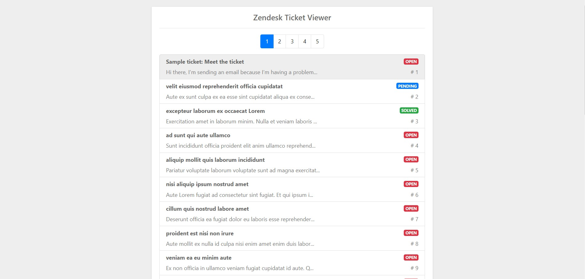

# Zendesk-Coding-Challenge-Amol-Sangar
Zendesk Ticket Viewer




# Prerequisites
- npm
- nodejs

# Installation 
```
git clone https://github.com/amolsangar/Zendesk-Coding-Challenge-Amol-Sangar.git
```

```
npm install
```

# How to run
- **.env file** - Add credentials inside the environment file namely TOKEN, SUBDOMAIN NAME and EMAIL ADDRESS. 

  **Run Command**
- ```npm start``` – This will start the express server and will listen on port 7777
- ```npm test``` – Runs a series of test to check the api and server functionality. Tests include authentication and wrong parameters scenarios.

# Project Structure Overview
- index.js – Entry point

  ----
  
- scripts/server.js – defines and implements routing endpoints 
  1.	get_tickets_per_page
  2.	get_all_tickets
  3.	count
- scripts/zendeskApiHandler.js – handles REST requests to Zendesk API along with authentication
  
  ----
  
- test/server.test.js – Test cases to check the functionality of server
- test/ zendeskApiHandler.test.js - Test cases to check the functionality of Zendesk API Handler
  
  ----
  
- website/index.html – Zendesk ticket viewer webpage
- website/js/scripts.js – JavaScript required for the working of webpage
- website/css/style.css – Webpage styling

# Explanation
  - For backend, I used **express** and **nodejs** to setup my server. The server communicates with Zendesk API to fetch the data and then sends it to the frontend.
  - The frontend is built with **Bootstrap** framework and utilizes the result from server to display ticket data. 
  - The rest calls are triggered per page and thus fetches data as and when required. This results in avoiding unnecessary load on the main Zendesk API if one were to fetch complete data which could be in thousands or millions. 
